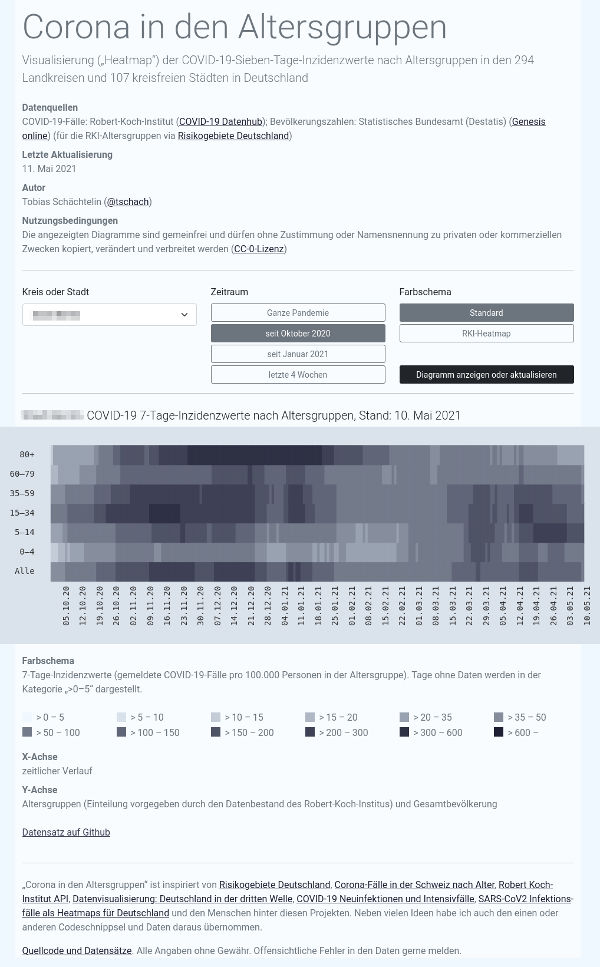

# Corona in den Altersgruppen

Visualisierung („Heatmap“) der COVID-19-Sieben-Tage-Inzidenzwerte nach Altersgruppen in den 294 Landkreisen und 107 kreisfreien Städten in Deutschland

- https://tschach.github.io/covaltvis/

